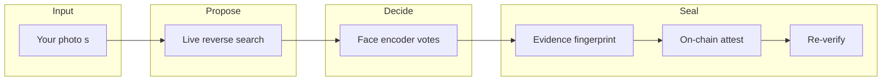
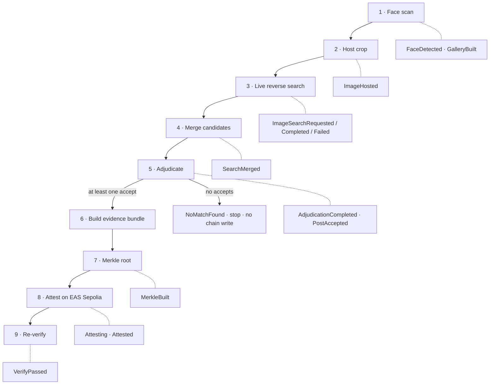
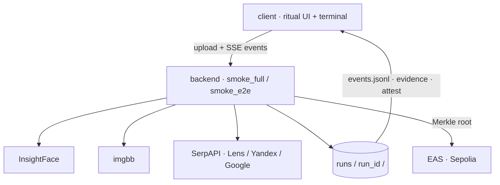

# Eye of the Witch

**HH Goa 2026 — Task 3**

> Face scan → live web / social search → on-chain fingerprint → re-verify

A face shows up. The public web has many lookalikes and recycled photos.  
Search engines *propose* pages. They do not *decide* who the person is.  
This project is a pipeline that **checks**, **decides**, and **seals** that whole check so anyone can re-read it later.

---

## The problem we are solving

If you only reverse-image-search a face, three things go wrong:

| What goes wrong | Why it hurts |
|---|---|
| Search returns junk or lookalikes | A “similar image” is not the same person |
| Exact photo matches can poison you | Same pixels, different face → wrong identity cascade |
| A list of URLs is not proof | Anyone can edit a demo; nothing is committed |

So we ask a different question:

> **Can we take a face, search the live public web, let the face model vote on every candidate, and put a fingerprint of that whole check on chain — then prove it still matches?**

That is the pipeline. Everything else (UI ritual, optional expand hop, evidence map) sits around that spine.

---

## How we thought about it (from every side)

We designed the pipeline as four honest jobs, not as a pile of features.



| Side | What we care about |
|---|---|
| **Face** | Detect + encode. Multi-photo gallery if you give angles. The seed is ground truth for ranking. |
| **Search** | Real engines (Lens / Yandex / Google reverse) — live, not hardcoded URLs. Search only *proposes*. |
| **Decision** | Cosine similarity bands: accept / abstain / reject. Near-exact image without a strong face match → reject. |
| **Chain** | Merkle over the **whole check** (probe + every verdict + accepts), attest on EAS Sepolia, rebuild and match. |

**Search proposes → encoder decides → seal the whole check.**  
That one sentence is the product.

---

## The pipeline



### 1 · Face scan

Detect the face, encode it (InsightFace).  
One photo works. Several angles make ranking steadier — we keep a small **seed gallery** and pick the best crop(s) for search.

### 2 · Host the crop

Search engines need a public URL. We upload the crop temporarily (imgbb), then forget hosting — it is glue, not the point.

### 3–4 · Live search + merge

Ask Google Lens, Yandex Images, and Google Reverse Image.  
Merge and dedupe by URL. Prefer social domains when scores are close — but the **seed face always wins** over “the engine liked this page.”

### 5 · Adjudicate (this is where math changes the outcome)

For each candidate thumbnail we compare faces to the seed:

| Similarity | Decision | Meaning |
|---|---|---|
| ≥ 0.25 | **accept** | Strong enough to keep |
| 0.20 – 0.25 | **abstain** | Gray band — not sealed as a match |
| &lt; 0.20 | **reject** | Too weak |
| Near-exact photo, weak face vs seed | **reject** | Anti-poison |

Then we emit `AdjudicationCompleted` (counts + thresholds) and `PostAccepted` for the accepts.

### 6–9 · Seal + chain + re-verify

We do **not** put the face on chain.  
We fingerprint the **evidence bundle**:

1. **Probe** — what we searched with  
2. **Verdicts** — how we voted each candidate  
3. **Accepts** — what we kept  

Merkle root → attest on **EAS (Sepolia)** → rebuild locally from `evidence.json` → confirm it matches the on-chain hash.

---

## Architecture (what talks to what)



| Piece | Role |
|---|---|
| `backend/` | Canonical pipeline — run this day to day |
| `client/` | Left: ritual. Right: live terminal of events |
| `runs/<run_id>/` | One folder = one investigation |
| `events.jsonl` | Append-only story the UI tails |
| `events_contract.md` | Shared vocabulary of those events |

Root-level `smoke_*.py` is the older CLI copy; **`backend/`** is what the UI drives.

---

## A run is a folder

Every execution writes `backend/runs/<run_id>/` (also visible as `runs/` when symlinked).

```text
runs/full-20260904T112413Z-0f9c6d60/
├── events.jsonl      ← live story (UI terminal)
├── gallery.json      ← seed photos kept / rejected
├── accepted.json     ← posts with decision=accept
├── evidence.json     ← sealed adjudication bundle
├── merkle.json       ← root + leaf digests
├── attest.json       ← tx, uid, EASScan link
├── verify.json       ← rebuild vs chain
├── graph.json        ← optional map of the hunt
└── smoke_report.json ← pass / no-match / fail
```

**Exit codes:** `0` pass · `2` no match (no chain write) · `1` hard failure.

### Events = the story of the run

Success path (simplified):

```text
FaceDetected → GalleryBuilt → ImageHosted
  → ImageSearchRequested → ImageSearchCompleted… → SearchMerged
  → AdjudicationCompleted → PostAccepted
  → GraphUpserted → MerkleBuilt → Attesting → Attested → VerifyPassed
```

Off-ramps:

- `NoMatchFound` — candidates existed, none accepted → **no** chain write  
- `Failed` — hard error (bad image, API, RPC, …)

Full field notes: [`events_contract.md`](events_contract.md).  
Longer walkthrough: [`docs/pipeline-friendly-guide.md`](docs/pipeline-friendly-guide.md).

---

## Run it

### Backend

```bash
cd backend
python3 -m venv .venv && source .venv/bin/activate
pip install -r requirements.txt
```

Create `backend/.env` (never commit):

```bash
SERPAPI_API_KEY=...
IMGBB_API_KEY=...
SEPOLIA_RPC_URL=https://ethereum-sepolia-rpc.publicnode.com
PRIVATE_KEY=0x...   # Sepolia-funded; rotate if exposed
```

```bash
# Full pipeline (multi-engine + gallery scoring + evidence seal + EAS)
.venv/bin/python smoke_full.py samples/photo1.jpg

# Stronger ranking: 2–5 public photos of the same person
.venv/bin/python smoke_full.py samples/a.jpg samples/b.jpg samples/c.jpg

# Leaner path (Lens-focused)
.venv/bin/python smoke_e2e.py --insightface samples/photo1.jpg
```

### UI

```bash
cd client && npm install && npm run dev
```

Default: plays a fixture from `client/fixtures/`.  
Live: point at a `backend/` run so the terminal tails `events.jsonl` — see [`client/CLAUDE.md`](client/CLAUDE.md).

---

## On-chain (honest, short)

| | |
|---|---|
| Network | Ethereum **Sepolia** |
| Service | **EAS** — attestation of `bytes32 contentHash` |
| Content | Merkle root of the **adjudication evidence bundle** |
| Check | Rebuild from `evidence.json` ↔ on-chain `contentHash` |

Explorer links land in `attest.json` (`easscan`, `tx_url`).

This is **similarity evidence**, not legal identity proof. Use publicly indexed images (public figure or your own public photo).

---

## Repo map

```text
backend/          pipeline you run day to day
client/           ritual UI + event terminal
docs/             design notes + friendly pipeline guide
events_contract.md
architecture.md
```

---

## Task checklist

- [x] Face detect + encode  
- [x] Genuine live web / social search → ≥1 matching post when the web has one  
- [x] Evidence fingerprint on chain + re-verify  
- [x] Pipeline runs standalone (no website required)  
- [x] Split-screen UI wired to live events  
- [x] Source + this README  

---

**One line:** scan the face → let the web propose → let the encoder decide → seal the whole check on Sepolia → prove it still matches.
