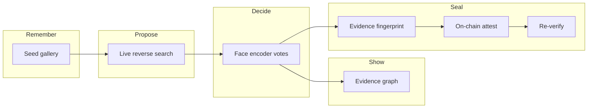
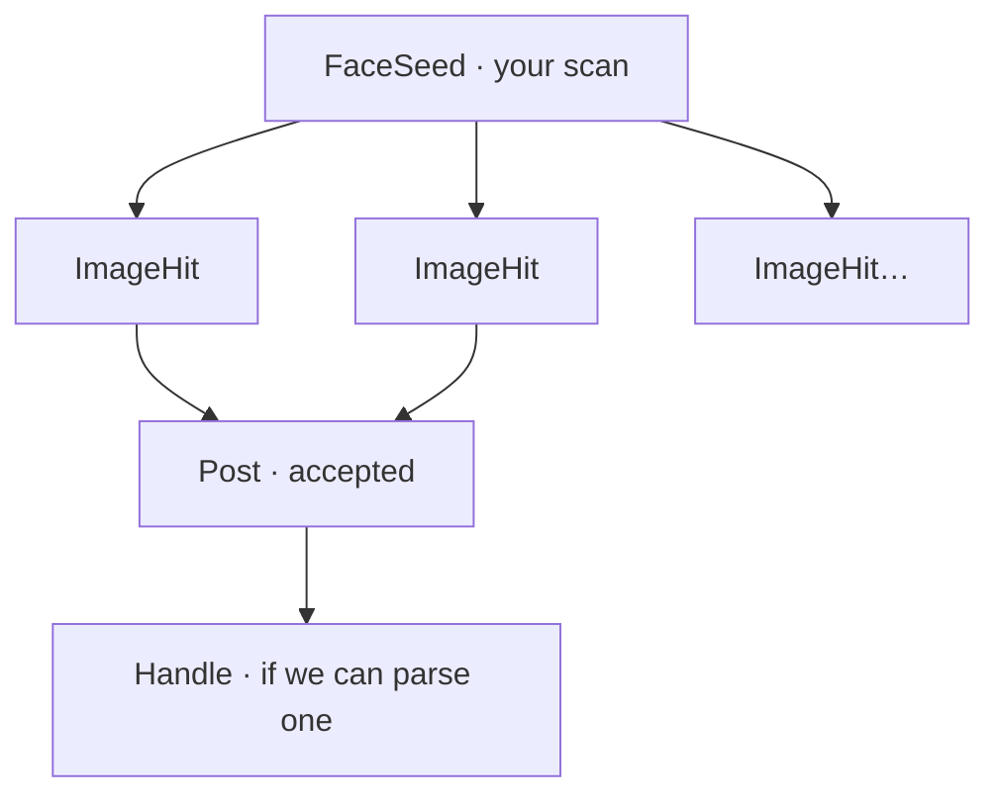
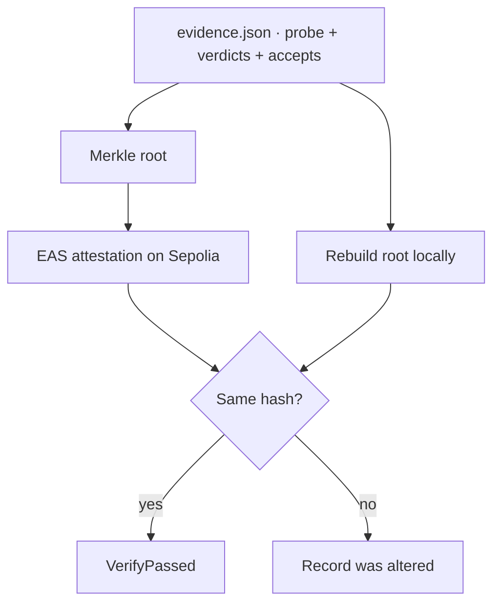
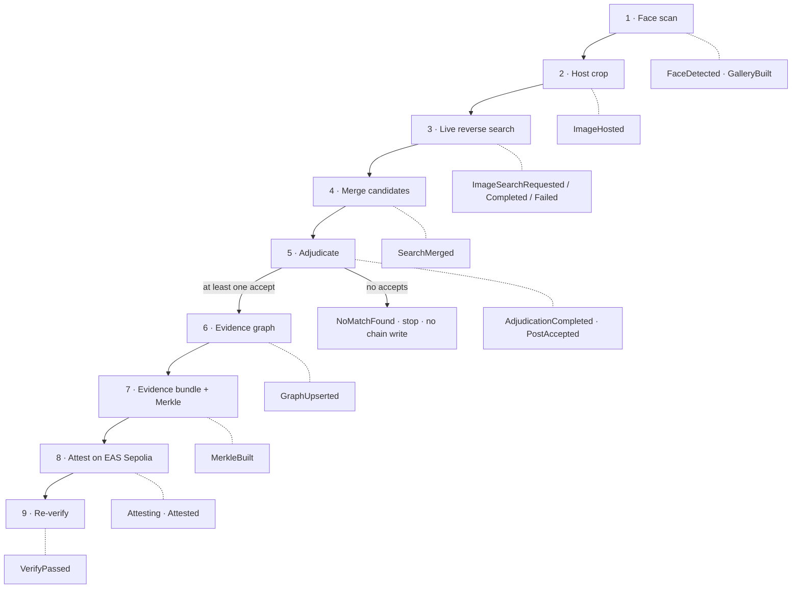
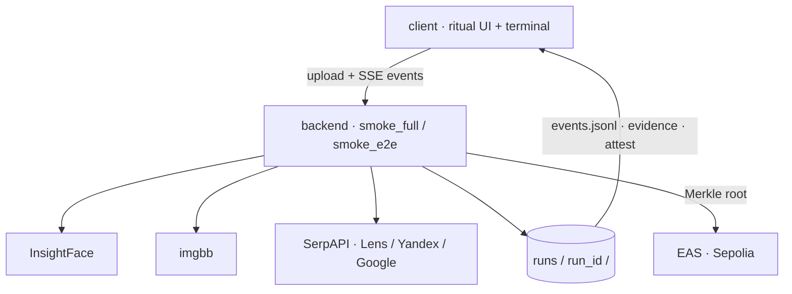

# Eye of the Witch

**HH Goa 2026 — Task 3**

> Face scan → live web / social search → on-chain fingerprint → re-verify

A face shows up. The public web has many lookalikes and recycled photos.  
Search engines *propose* pages. They do not *decide* who the person is.  
This project is a pipeline that **checks**, **decides**, and **seals** that whole check so anyone can re-read it later.

---

## The problem we are solving

If you only reverse-image-search a face, more goes wrong than “no match”:

| What goes wrong | Why it hurts |
|---|---|
| One photo is a weak clue | Pose, light, blur — ranking against web thumbs wobbles |
| Search returns junk or lookalikes | A “similar image” is not the same person |
| Exact photo matches can poison you | Same pixels, different face → wrong identity cascade |
| A flat list of URLs is hard to audit | You cannot see *how* the hunt went, only the winners |
| Someone edits the record later | Change a URL, a title, a hash, a vote — demo still “looks fine” unless the seal notices |

So we ask a harder question:

> **Can we take a face (maybe several angles), search the live public web, let the face model vote on every candidate, keep a readable map of the hunt, and put a fingerprint of that whole check on chain — so if anyone changes the record later, re-verify fails?**

That is the pipeline.

---

## How we thought about it (from every side)

Not four features. Four jobs — plus the small cares that keep them honest.



| Side | What we care about |
|---|---|
| **Gallery** | Your photos are ground truth. Same person only (`cosine ≥ 0.35` vs primary); weak / wrong-person inputs stay out. |
| **Search** | Real engines, live — not hardcoded URLs. Search only *proposes*. |
| **Decision** | Cosine bands change the vote: accept / abstain / reject. Near-exact + weak face → reject. |
| **Graph** | A map of the hunt you can open later — not only a sealed hash. |
| **Seal** | SHA-256 leaves → Merkle root on chain. Change a leaf → root moves → re-verify fails. |

**Search proposes → encoder decides → remember the path → seal the whole check.**

### Gallery — caring about the seed

One blurry selfie is a weak clue. Front + side + better light is steadier.

When you give several photos we:

- Detect and encode each one (512-D face vector)  
- Keep only faces with **cosine ≥ 0.35** vs the primary (same person)  
- Score quality (detection confidence + sharpness)  
- Pick the best crop(s) as search probes  

So the gallery is not “upload more files for show.” It is how we make ranking fair when the web only returns messy thumbnails. Written to `gallery.json`.

### Graph — caring about the path, not only the winners

The chain seal answers: *did this check change?*  
The graph answers: *what did we actually look at?*



After ranking we write `graph.json`: seed → every search hit → accepted posts (and handles when we can read them).  
Emit `GraphUpserted`. You can open the file and *see* the investigation — the seal alone would not tell that story.

### Seal — caring when the verifiable record changes

We do not put the face on chain. We put a fingerprint of the **evidence bundle**:

| Leaf kind | What it commits to |
|---|---|
| **Probe** | Seed embedding fingerprint + gallery size |
| **Verdict** | URL + content hash + sim + decision |
| **Accept** | Kept post + content hash + observed time |

Each leaf is **SHA-256**; the tree root is a **Merkle root** (pairwise hash up). That root is what EAS stores.



**If someone later changes the verifiable record** — swap a URL, flip a verdict, tweak a content hash, change observed time — any leaf bytes change → **Merkle root moves** → re-verify against the chain **fails**. That is why we seal the whole check, not only the winners.

CDN thumbnails may expire; we hash what we saw **at accept time** so the seal does not depend on hotlinks staying forever.

### Small cares (easy to skip, hard to regret)

| Care | Why |
|---|---|
| Engines can fail individually | One dead engine ≠ whole run dies (`ImageSearchFailed`, continue) |
| Abstain band (`0.20–0.25`) | Mid cosine scores are not quietly treated as matches |
| No accepts → no chain write | `NoMatchFound` — we do not attest an empty victory |
| Seed face beats “engine said so” | Ranking is owned by the encoder |
| Events are append-only | `events.jsonl` is the live lab notebook the UI tails |
| One run = one folder | Artifacts stay together; nothing is “true” only in memory |

---

## The pipeline



### 1 · Face scan + seed gallery

Detect the face, encode it (InsightFace).  
One photo works. Several angles → **seed gallery** (same-person filter, quality, best probes).  
Events: `FaceDetected`, `GalleryBuilt`. Details in *Gallery* above.

### 2 · Host the crop

Search engines need a public URL. We upload the crop temporarily (imgbb), then forget hosting — it is glue, not the point.

### 3–4 · Live search + merge

Ask Google Lens, Yandex Images, and Google Reverse Image.  
Merge and dedupe by URL. Prefer social domains when scores are close — but the **seed face always wins** over “the engine liked this page.”

### 5 · Adjudicate (math that changes the outcome)

Score each candidate with **cosine similarity** of face embeddings vs the seed gallery (best match). Then vote:

| Cosine sim | Decision | Meaning |
|---|---|---|
| **≥ 0.25** | **accept** | Strong enough to keep |
| **0.20 – 0.25** | **abstain** | Gray band — not sealed as a match |
| **&lt; 0.20** | **reject** | Too weak |
| Near-exact photo **and** face &lt; **0.40** | **reject** | Anti-poison (same pixels ≠ same person) |

Those thresholds are not decoration — they decide who enters the seal.  
Emit `AdjudicationCompleted` (counts + τ) and `PostAccepted` for accepts.

### 6 · Evidence graph

Write the hunt map (`graph.json`) — seed, hits, accepts — so the path is readable, not only sealed. Event: `GraphUpserted`.

### 7–9 · Seal + chain + re-verify

**SHA-256** evidence leaves → **Merkle root** → attest on **EAS (Sepolia)** → rebuild from `evidence.json` → match on-chain.  
Edit a sealed field later → root moves → re-verify fails. See *Seal* above.

---

## Architecture (what talks to what)



| Piece | Role |
|---|---|
| `backend/` | Canonical pipeline — run this day to day |
| `client/` | Left: ritual. Right: live terminal of events |
| `runs/<run_id>/` | One folder = one investigation |
| `events.jsonl` | Append-only story the UI tails |
| `events_contract.md` | Shared vocabulary of those events |

Root-level `smoke_*.py` is the older CLI copy; **`backend/`** is what the UI drives.

---

## A run is a folder

Every execution writes `backend/runs/<run_id>/` (also visible as `runs/` when symlinked).

```text
runs/full-20260904T112413Z-0f9c6d60/
├── events.jsonl      ← live story (UI terminal)
├── gallery.json      ← seed: kept / rejected / quality
├── accepted.json     ← posts with decision=accept
├── evidence.json     ← sealed bundle (probe + verdicts + accepts)
├── merkle.json       ← root + leaf digests
├── attest.json       ← tx, uid, EASScan link
├── verify.json       ← rebuild vs chain (fails if record edited)
├── graph.json        ← map of the hunt (seed → hits → posts)
└── smoke_report.json ← pass / no-match / fail
```

**Exit codes:** `0` pass · `2` no match (no chain write) · `1` hard failure.

### Events = the story of the run

Success path (simplified):

```text
FaceDetected → GalleryBuilt → ImageHosted
  → ImageSearchRequested → ImageSearchCompleted… → SearchMerged
  → AdjudicationCompleted → PostAccepted
  → GraphUpserted → MerkleBuilt → Attesting → Attested → VerifyPassed
```

Off-ramps:

- `NoMatchFound` — candidates existed, none accepted → **no** chain write  
- `Failed` — hard error (bad image, API, RPC, …)

Full field notes: [`events_contract.md`](events_contract.md).  
Longer walkthrough: [`docs/pipeline-friendly-guide.md`](docs/pipeline-friendly-guide.md).

---

## Run it

### Backend

```bash
cd backend
python3 -m venv .venv && source .venv/bin/activate
pip install -r requirements.txt
```

Create `backend/.env` (never commit):

```bash
SERPAPI_API_KEY=...
IMGBB_API_KEY=...
SEPOLIA_RPC_URL=https://ethereum-sepolia-rpc.publicnode.com
PRIVATE_KEY=0x...   # Sepolia-funded; rotate if exposed
```

```bash
# Full pipeline (multi-engine + gallery scoring + evidence seal + EAS)
.venv/bin/python smoke_full.py samples/photo1.jpg

# Stronger ranking: 2–5 public photos of the same person
.venv/bin/python smoke_full.py samples/a.jpg samples/b.jpg samples/c.jpg

# Leaner path (Lens-focused)
.venv/bin/python smoke_e2e.py --insightface samples/photo1.jpg
```

### UI

```bash
cd client && npm install && npm run dev
```

Default: plays a fixture from `client/fixtures/`.  
Live: point at a `backend/` run so the terminal tails `events.jsonl` — see [`client/CLAUDE.md`](client/CLAUDE.md).

---

## On-chain (honest, short)

| | |
|---|---|
| Network | Ethereum **Sepolia** |
| Service | **EAS** — attestation of `bytes32 contentHash` |
| Content | Merkle root of the **adjudication evidence bundle** |
| Check | Rebuild from `evidence.json` ↔ on-chain `contentHash` |

Explorer links land in `attest.json` (`easscan`, `tx_url`).

This is **similarity evidence**, not legal identity proof. Use publicly indexed images (public figure or your own public photo).

---

## Repo map

```text
backend/          pipeline you run day to day
client/           ritual UI + event terminal
docs/             design notes + friendly pipeline guide
events_contract.md
architecture.md
```

---

## Task checklist

- [x] Face detect + encode  
- [x] Genuine live web / social search → ≥1 matching post when the web has one  
- [x] Evidence fingerprint on chain + re-verify  
- [x] Pipeline runs standalone (no website required)  
- [x] Split-screen UI wired to live events  
- [x] Source + this README  

---

**One line:** steady the seed → let the web propose → let the encoder decide → map the hunt → seal the whole check → prove edits break the seal.
